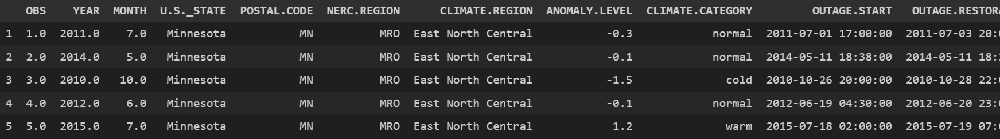
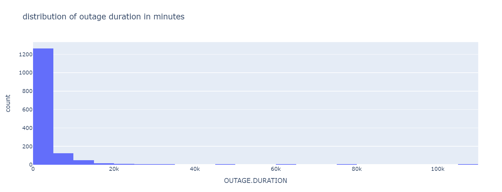
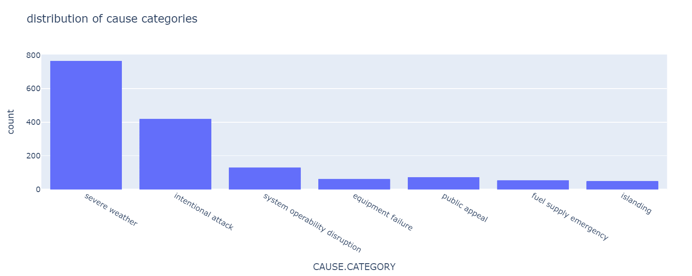
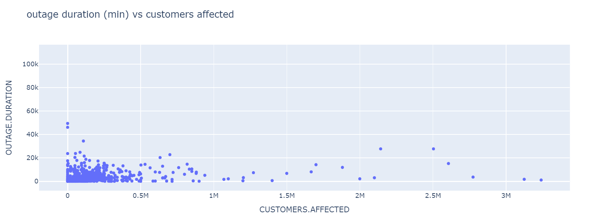
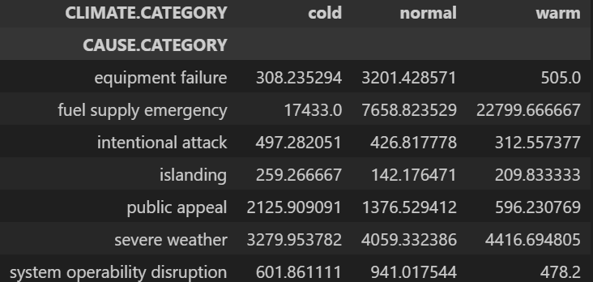
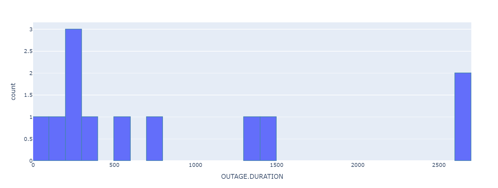
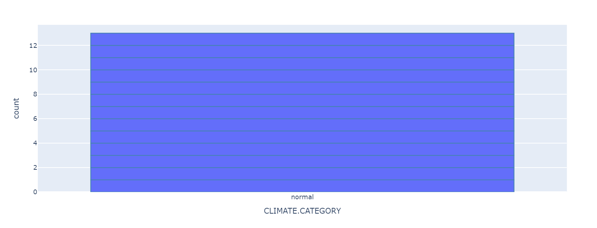

# Going Out

##### DSC 80 Final Project by Kristina Nguyen and Durga Nair

## Introduction

This project analyzes various features related to power outages to identify key factors influencing their duration. Using statistical analysis we uncover patterns in outage duration and propose predictive models to keep people informed and prepared for the durations of outages. We are focusing on one question in specific: 
> ### **What factors contribute to the duration of a power outage?**

The dataset we are working with has 1534 rows and 58 columns, but while we looked at a lot of these columns to figure out which ones were most important to answering our question, we ended up finalizing a couple columns that we wanted to focus our exploration on: `OUTAGE.DURATION`, `NERC.REGION`, `CAUSE.CATEGORY`, and `CLIMATE.CATEGORY`. `OUTAGE.DURATION` is the time that the outage lasted in minutes, saved as an integer. *NERC* stands for North American Electric Reliability Corporation, so `NERC.REGION`s are essentially U.S. regions sectioned off by electricity supply. `CAUSE.CATEGORY` is a string that represents what caused the power outage and `CLIMATE.CATEGORY` is a string value of either 'cold', 'warm', or 'normal' based on what the climate is like in the area where the power went out.

---

## Data Cleaning and Exploratory Data Analysis

#### **Data Cleaning:**

Data was preprocessed to combine date and time fields for outage start and restoration times. Since we were testing the distribution of essentially every column, all of the columns had to be cleaned. Most of the data was already cleaned for us, but the main thing we had to do was clean up how the time that each outage started and ended was stored. When we started looking at the data, there were two columns for each `OUTAGE.START.DATE`, `OUTAGE.START.TIME`, `OUTAGE.RESTORATION.DATE`, and `OUTAGE.RESTORATION.TIME`. Instead of this, we combined the date and time fields in order to get `OUTAGE.START` and `OUTAGE.RESTORATION`. This allowed us to be more precise with the data and allow us to not just look at date and time separately. Below is what the first couple rows of the data looked like:

#### **Exploratory Analysis:**

Exploratory visualizations and analyses were conducted to understand the distribution of outage durations and other variables, as well as relationships between variables. We used histograms for the numerical values, bar graphs for categorical variables, and made scatter plots of quantitative variables against outage duration. We also created box plots of outage duration conditional on categorical variables and a pivot table of mean outage durations, conditioned on climate and cause categories.

#### **Univariate Analysis**

We examined the distribution of individual columns first to better understand how each feature varied across the dataset. This analysis helps identify patterns, outliers, and the overall spread of the data, giving us insights into the individual characteristics of each feature. Below is a visualization showing the distribution of `OUTAGE.DURATION`. The plot reveals that the data is skewed to the right suggesting that the majority of the outage durations are relatively short and are typically shorter than 5000 minutes, though there are a few instances where the outage lasted much longer than the average.

We also looked at the distribution of categorical data such as `CAUSE.CATEGORY`, which showed us that the majority of power outages seemed to be caused by severe weather. 

#### **Bivariate Analysis**

To understand how outage duration relates to other features, we explored potential correlations and trends between the `OUTAGE.DURATION` column and other columns such as `CUSTOMERS.AFFECTED`. The below scatter plot displays this relationship, which shows that there is not much of a correlation other than that short power outages that didn't affect many people were common.

#### **Interesting Aggregates**

---

## Assessment of Missingness

After analysing the missingness in the dataset, we determined that `OUTAGE.DURATION` is likely NMAR. This conclusion is based on the hypothesis testing results from a permutation test we conducted, where the p-value for the relationship between missingness in `OUTAGE.DURATION` and the feature `miss` was not statistically significant which helps us conclude that the missingness in `OUTAGE.DURATION` is not due to the missingness in other columns.

On the other hand, `CLIMATE.CATEGORY` seems to be MAR with respect to `TOTAL.SALES` due to the significant p-value in the permutation test we conducted.

---

## Hypothesis Testing

We had a couple of hypothesis tests that we were looking at:

#### OUTAGE DURATION ACROSS NERC REGION
- Null Hypothesis: Outage duration is the same across all NERC regions
- Alternative Hypothesis: Outage duration is different across NERC regions
- Test Statistic: Total Variation Distance
	- We used TVD as the test statistic to compare categorical distributions between two groups. It quantifies the difference between the observed distribution and the expected distribution if the null hypothesis were true.
- At a significance level of 0.05, the null hypothesis is rejected, suggesting that NERC region may be correlated with outage duration.

#### OUTAGE DURATION ACROSS CAUSE CATEGORIES
- Null Hypothesis: Outage duration is the same across all cause categories
- Alternative Hypothesis: Outage duration is different across cause categories
- Test Statistic: Total Variation Distance
	- We use TVD to measure how different the distribution of outage durations is across different cause categories.
- At a significance level of 0.05, the null hypothesis is rejected,suggesting that cause category may be correlated with outage duration.

#### OUTAGE DURATION ACROSS CLIMATE CATEGORIES
- Null Hypothesis: Outage duration is the same across all climate categories
- Alternative Hypothesis: Outage duration is different across climate categories
- Test Statistic: Total Variation Distance
	- We used TVD again to measure differences in the distribution of outage durations between climate categories
- At a significance level of 0.05, the null hypothesis is rejected, suggesting that climate category may be correlated with outage duration.

---

## Framing a Prediction Problem

For this prediction problem, we decided to predict the duration of a power outage. This is a regression task based on the response variable `OUTAGE.DURATION`. The duration of a power outage is a critical factor for utility companies and affected customers, Understanding and predicting the duration can help in preparing for outagesm improving customer service, and informing resource allocation.

We chose Root Mean Squared Error (RMSE) as the metric for evaluating our regression model. RMSE is the square root of the average quared differences between predicted and actual values. It is particularly useful in this context because it gives more weight to larger errors, which may be more costly or impactful when predicting outage durations.
RMSE provides a direct measure of how far off our predictions are, on average, from the true values. Since the larger errors in outage duration predictions could significantly impact utility response efforts, RMSE helps prioritize minimizing those larger discrepancies. Other metrics like Mean Absolute Error could also be considered, but as RMSE is more sensistive to large errors it helps us focus on reducting extreme prediction errors.

To preduct outage duration, we only use features that are available at the time of prediction.
- NERC Region: the region in which the outage occurs may influence its duration due to regional infrastructure, weather patters, and resource availability
- Cause Category: the reason for the outage could significantly affect how long it takes to restore power
- Climate Category: environmental factors can influence the time required to fix outages

This is a regression problem where we aim to predict the duration of a power outage using features such as the NERC region, cause category, and climate category. The model's performance is evalueated using RMSE, which helps us assess prediction accuracy while penalizing large errors.

---

## Baseline Model

We built a linear regression model to predict the duration of a power outage. The model was trained using the features listed above that are available at the time of prediction: `NERC.REGION`, `CAUSE.CATEGORY`, and `CLIMATE.CATEGORY`, all of which are nominal variables. For these features, we applied One-Hot Encoding to create new binary features for each category within the variables. For example, there are 13 possible regions in `NERC.REGION`, so 13 binary columns are created.

We used a pipeline from `sklearn` to first apply One-Hot Encoding to the categorical features and then perform linear regression on the transformed dataset. The pipeline ensures that data preprocessing and model training are handled sequentially and consistently.

The performance of the model was evaluated using RMSE. After trainging the model on the training set and making predictions on the test set, we foud that the RMSE was around 4300, which indicates that the model has significant prediction error. Given this high RMSE, the model's performance is cosidered **poor**. This suggests that our model is not accurately predicting the duration of power outages. This could be due to several problems:
- Complexity of the problem: outage duration can be affected by many complex, often unobservable factors such as real-time repair operations, weather conditions, and infrastructure status.
- Feature selection: the features chosen for the model may not fully capture the dynamics of power outages. We might need additional or more refined features to improve the model
- Model choice: a simple linear regression model may not be powerful enough to capture the relationships between the features and the target variable. More complex models, such as decision trees or random forests might perform better

---

## Final Model

The features selected and transformations applied were carefully chosen based on their potential relevance to predicting power outage duration and improving the model's ability to capture underlying relationships
- Square root transformation for `CUSTOMERS.AFFECTED`: this transformation helps reduct the skewness of the data, ensuring that large outlier values do not disproportionately affect the regression model
- Log transformation for `TOTAL.SALES` and `PCT_WATER_TOT`: these transformations were applied to handle skewed distributions and emphasize smaller differences in lower values, which are often more predictive
- Adding polynomidal terms of degree 2 for quantitative features (`CUSTOMERS.AFFECTED`, `TOTAL.SALES`, `PCT_WATER_TOT`, `UTIL.CONTRI`, and `RES.CUST.PCT`) allows the model to capture nonlinear relationships between these predictors and outage duration
- We still used One-Hot Encoding for categorical variables that we had before to allow the model to differentiate between the categories without assuming an ordinal relationship.

The final model includes transformed quantitative features (square root, log, and polynomial terms) and one-hot encoded categorical variables which allows the model to account for both linear and nonlinear effects, as well as categorical variations.

The final model is a linear regression model that incorporates feature transformations and polynomial terms for flexibility. We tested a Decision Tree Regressor as an alternative, but cross-validation results showed that the linear regression model outperformed n terms of RMSE. The degree of polynomial features was tuned from 1 to 25 using cross-validation, with degree 2 providing the best balance between complexity and performance. Various transformations weere tested for the quantitative features using cross-validation to determine which approach worked best for each feature. Cross-validation with 5 folds was used to evaluate the performance of different models and transformations.

#### Baseline vs Final

The baseline model used simple linear regression without feature transformation or polynomial terms and had an RMSE of about 4300 minutes.

The final model incorporates square root and log transformations for selected features, polynomial features of degree 2, and one-hot encoding for categorical variables and the RMSE was reduced, though only by about 4 minutes.

The final model represents an improvement in terms of flexibility, but the overall performance shows that there is still much room for improvement. The high RMSE indicates that outage duration may depend on additional unobserved varibales or complex dynamics not captured by the current features.

---

## Fairness Analysis

We chose the following groups:

Group X: Outages occurring in areas with low population density

Group Y: Outages occurring in areas with high population density

These groups were chosen to evaluate whether the model's performance is consistent across different population densities, enuring fairness in prediction quality. We used the absolute difference in mean RMSE as the evaluation metric to assess whether the model performs equally for both groups.

- Null Hypothesis: the model performs equally across areas with low and high population density, with no significant difference in RMSE.
- Alternative Hypothesis: the model performs differently in areas with low and high population density, with significant differences in RMSE.

A permutation test was performed to compute the p-value. This allowed us to assess whether the observed difference in mean RMSE is due to chance. The final results were in the form of the absolute difference in mean RMSE as our observed test statistic and a p-value equal to the proportiion of permuted test statistics that exceeded the observed statistic.

At a significance level of 0.05, the null hypothesis is failed to be rejected. This indicates that there is no statistically significant difference in RMSE between areas with low and high population density. Therefore, the model may be considered fair in its performance across these groups.

---

##### Kristina Nguyen & Durga Nair
